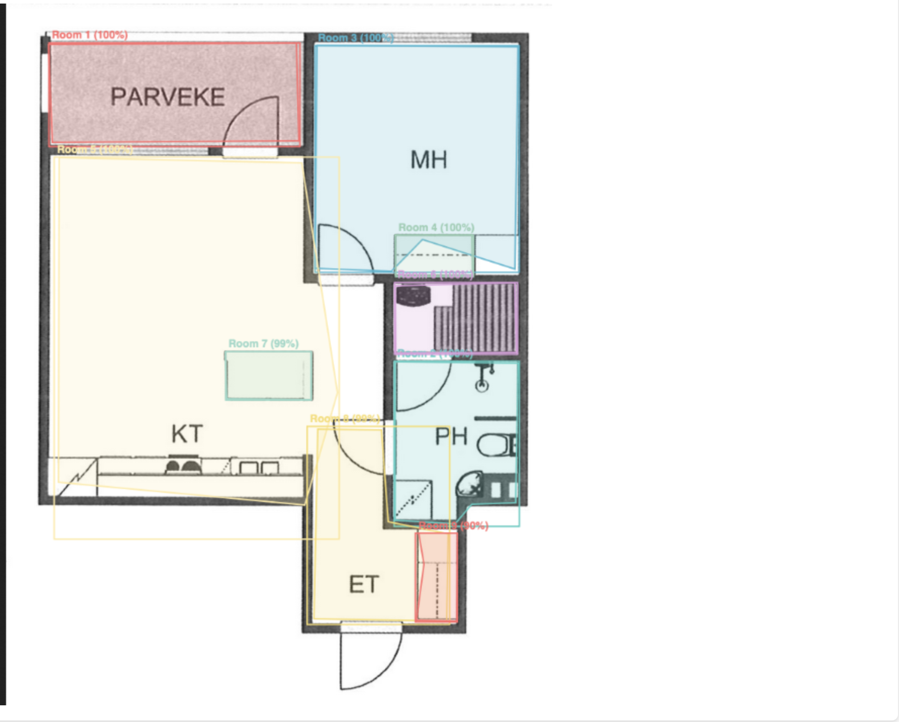

# Innergy Room Detection Service

An AI-powered web application for automatic room boundary detection on architectural blueprints. Upload floor plans and instantly get precise room segmentation with bounding boxes, polygonal boundaries, and confidence scores. Built with a PyTorch Mask R-CNN model for accurate detection of room boundaries, walls, and spaces in architectural drawings.



## Features

- **Automatic Room Detection**: Upload any blueprint image and get instant room boundary detection
- **Visual Overlays**: Color-coded bounding boxes and polygonal outlines for each detected room
- **High Accuracy**: Mask R-CNN with ResNet50-FPN backbone trained on architectural floor plans
- **Confidence Scoring**: Adjustable detection threshold to control sensitivity
- **Export Ready**: JSON output with normalized coordinates (0-1000 range) for integration
- **Overlap Filtering**: Automatically merges overlapping detections for cleaner results
- **Real-time Processing**: CPU/GPU inference in 1-5 seconds per image
- **No Build Required**: Single-file React frontend with zero dependencies

## Quick Start

### 1. Backend Setup

```bash
cd backend

# Install dependencies
pip install -r requirements.txt

# Copy model weights (you need maskrcnn_best.pth from Tanner)
cp /path/to/maskrcnn_best.pth .

# Run server
python main.py
```

Backend runs at `http://localhost:8000`

### 2. Frontend

Just open `frontend/index.html` in a browser, or serve it:

```bash
cd frontend
python -m http.server 3000
```

Then open `http://localhost:3000`

## API Endpoints

### Health Check
```
GET /health
```

### Detect Rooms
```
POST /detect
Content-Type: multipart/form-data

file: <image file>
threshold: 0.7 (optional, default 0.7)
overlap_threshold: 0.3 (optional)
```

**Response** (matches PRD spec):
```json
{
  "image_size": {"width": 512, "height": 512},
  "total_rooms": 3,
  "rooms": [
    {
      "id": "room_001",
      "bounding_box": [50, 50, 200, 300],
      "bbox_pixels": {"x1": 25, "y1": 25, "x2": 100, "y2": 150},
      "vertices": [[25, 25], [100, 25], [100, 150], [25, 150]],
      "confidence": 0.95,
      "name_hint": null
    }
  ]
}
```

## Output Format

The `bounding_box` field uses normalized coordinates (0-1000 range) as specified in the PRD:
- `[x_min, y_min, x_max, y_max]`

The `bbox_pixels` and `vertices` fields contain the original pixel coordinates for visualization.

## Project Structure

```
innergy-rooms/
├── backend/
│   ├── main.py              # FastAPI server
│   ├── requirements.txt
│   └── maskrcnn_best.pth    # Model weights (you provide)
├── frontend/
│   └── index.html           # React SPA (no build step)
└── README.md
```

## Tech Stack

- **Backend**: FastAPI + PyTorch + OpenCV
- **Frontend**: React (CDN, no build)
- **Model**: Mask R-CNN with ResNet50-FPN backbone

## Deployment

### Docker (Recommended)

Run the entire stack with Docker Compose:

```bash
# Make sure model file is in backend/
cp /path/to/maskrcnn_best.pth backend/

# Start services
docker-compose up -d

# Check status
docker-compose ps
docker-compose logs -f
```

Visit `http://localhost`

### AWS EC2 Deployment

See [DEPLOY.md](DEPLOY.md) for complete AWS deployment guide.

Quick setup:
```bash
# On EC2 instance
wget https://raw.githubusercontent.com/miriamsimone/room-detector/main/scripts/setup-ec2.sh
sudo chmod +x setup-ec2.sh
sudo ./setup-ec2.sh
```

## Notes

- Model automatically uses GPU if available, falls back to CPU
- Inference typically takes 1-5 seconds depending on hardware
- Overlapping room detections are automatically merged
